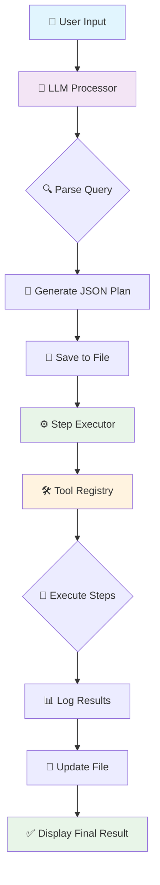

# 🧠 Tool-Enhanced Reasoning System

A powerful Python-based AI system that interprets natural language queries and executes them using an intelligent combination of **LLM reasoning** and **local tool execution**. The system acts as a bridge between human language and computational tools, providing step-by-step execution with comprehensive logging.

## 🌟 Key Features

- 🤖 **LLM-Powered Planning**: Uses Google Gemini 1.5 Flash to interpret queries and create execution plans
- 🛠️ **133 Built-in Tools**: Comprehensive math (57) and string (76) operations
- 🔄 **Multi-Step Reasoning**: Handles complex queries with variable storage and sequential operations
- 📄 **File-Based Logging**: Clean terminal output with detailed results saved to files
- ⚡ **Real-Time Processing**: Interactive mode for immediate query processing
- 🎯 **Smart Error Handling**: Graceful error management with clear feedback

## 🚀 Quick Start

### Prerequisites
- Python 3.7+
- Google Gemini API Key

### Installation
```bash
# Clone or download the project
cd q3

# Install dependencies
pip install -r requirements.txt

# Set up your API key
echo "GEMINI_API_KEY=your_api_key_here" > .env
```

### Usage
```bash
# Run the system
python main.py

# Interactive mode will start automatically
💬 Enter your query: What's the square root of the average of 25 and 75?
```

## 🔧 System Architecture

The system follows a **planner-executor** pattern where the LLM acts as an intelligent planner and local tools handle all computations.

### 📊 Workflow Diagram



## 📚 Core Components

### 🤖 LLM Processor
- **Purpose**: Interprets natural language and creates structured execution plans
- **Technology**: Google Gemini 1.5 Flash
- **Output**: JSON-formatted operation sequences
- **Features**: Multi-step reasoning, variable management, order of operations

### 🛠️ Tool Registry (133 Functions)

#### 📊 Math Tools (57 Functions)
- **Basic Arithmetic**: `add`, `subtract`, `multiply`, `divide`, `modulo`
- **Powers & Roots**: `square`, `cube`, `square_root`, `cube_root`, `nth_root`
- **Statistics**: `average`, `median`, `mode`, `variance`, `standard_deviation`
- **Advanced Math**: `factorial`, `gcd`, `lcm`, `percentage`, `is_prime`
- **Trigonometry**: `sin`, `cos`, `tan`, `asin`, `acos`, `atan`
- **Logarithms**: `log`, `log10`, `log2`, `natural_log`
- **Comparisons**: `greater_than`, `less_than`, `equal_to`

#### 📝 String Tools (76 Functions)
- **Counting**: `count_vowels`, `count_letters`, `count_words`, `count_sentences`
- **Case Conversion**: `uppercase`, `lowercase`, `camel_case`, `snake_case`
- **Manipulation**: `reverse_string`, `remove_spaces`, `trim_whitespace`
- **Analysis**: `is_palindrome`, `is_anagram`, `longest_word`, `word_frequency`
- **Validation**: `is_email`, `is_url`, `is_phone_number`
- **Search/Replace**: `find_substring`, `replace_substring`, `insert_at_position`

### ⚙️ Step Executor
- **Purpose**: Executes the LLM-generated plan step by step
- **Features**: 
  - Variable storage and retrieval
  - Sequential operation execution
  - Error handling and rollback
  - Comprehensive logging

### 💾 File Management
- **Output File**: `llm_response.txt`
- **Content**: Query, LLM response, execution steps, results, variables
- **Behavior**: Overwrites on each new query (no accumulation)

## 📖 Example Queries

### 🧮 Mathematical Operations
```
💬 "What's the square root of the average of 18 and 50?"
🎯 Result: 5.83 (average: 34, square root: 5.83)

💬 "Is 17 a prime number?"
🎯 Result: True

💬 "Calculate 15% of 240"
🎯 Result: 36.0
```

### 📝 String Operations
```
💬 "How many vowels are in 'Multimodality'?"
🎯 Result: 5

💬 "Is 'racecar' a palindrome?"
🎯 Result: True

💬 "Convert 'hello world' to camelCase"
🎯 Result: helloWorld
```

### 🔀 Complex Multi-Step Queries
```
💬 "Is the number of letters in 'machine' greater than the vowels in 'reasoning'?"
🎯 Steps: Count letters (7) → Count vowels (4) → Compare (True)

💬 "What's 9 + 2 * 4 - 3?"
🎯 Steps: Multiply (8) → Add (17) → Subtract (14)
```

## 📁 Project Structure

```
q3/
├── main.py                 # 🚀 Main application entry point
├── tools/
│   ├── math_tools.py      # 📊 57 mathematical functions
│   └── string_tools.py    # 📝 76 string manipulation functions
├── README.md              # 📚 This documentation
├── requirements.txt       # 📦 Python dependencies
├── .env                   # 🔐 Environment variables (API key)
└── llm_response.txt       # 📄 Generated results file
```

## 🔧 Technical Details

### Dependencies
- `google-generativeai`: LLM integration
- `python-dotenv`: Environment variable management
- `json5`: JSON parsing with enhanced error handling

### Environment Variables
- `GEMINI_API_KEY`: Your Google Gemini API key (required)

### Output Format
Results are saved to `llm_response.txt` with:
- 📅 Timestamp and user query
- 🤖 Raw and parsed LLM response
- ⚙️ Step-by-step execution log
- 💾 Variable storage details
- 🎯 Final results

## 💡 How It Works

1. **🎤 Input**: User enters a natural language query
2. **🧠 Planning**: LLM analyzes the query and creates a JSON execution plan
3. **💾 Logging**: Plan is saved to file for transparency
4. **⚙️ Execution**: System executes each step using appropriate tools
5. **📊 Tracking**: All intermediate results and variables are tracked
6. **📄 Output**: Complete results saved to file, summary shown in terminal

## 🛡️ Error Handling

- **🔍 JSON Validation**: Handles malformed LLM responses
- **🛠️ Tool Errors**: Graceful handling of computation errors
- **📝 Error Logging**: All errors saved to file with context
- **🔄 Recovery**: System continues running after errors

## 🎯 Use Cases

- **📚 Educational**: Learn math and string operations step-by-step
- **🧮 Calculations**: Complex mathematical computations with reasoning
- **📝 Text Analysis**: Comprehensive string manipulation and analysis
- **🔬 Research**: Understanding AI reasoning and tool integration
- **🤖 Development**: Building AI-powered computational assistants

## 🚀 Future Enhancements

- 📊 Data visualization tools
- 🌐 Web interface
- 📁 File manipulation tools
- 🗓️ Date/time operations
- 🔗 API integrations
- 📈 Performance analytics

---

## 🤝 Contributing

Feel free to extend the tool libraries or enhance the reasoning capabilities!

## 📄 License

This project is open source and available under standard licensing terms.

---

**🎉 Ready to enhance your reasoning capabilities? Start with `python main.py` and explore the power of AI-driven computational thinking!**
